<table>
<tr>
<td valign="top"></td>
<td valign="top"></td>
</tr>
</table>

## Charles Backman

**Quantitative Finance · Applied Machine Learning · Research Systems**

 

## Featured Project

### [Quant Systems Lab](https://github.com/Fink692/quant-systems-lab)

A tested Python quant-finance research platform covering stochastic-volatility options, queue-aware market making, risk-constrained RL trading, Barra-style factor risk, robust portfolio optimization, credit/default modeling, statistical arbitrage, volatility-surface arbitrage, and systemic-risk contagion.

Highlights:

- 170 automated tests with GitHub Actions CI.
- CLI workflows, generated Markdown reports, and reproducible SVG artifacts.
- Case study: [queue-aware market making](https://github.com/Fink692/quant-systems-lab/blob/main/docs/CASE_STUDY_MARKET_MAKING.md).
- Interview prep: [model and system-design talking points](https://github.com/Fink692/quant-systems-lab/blob/main/docs/INTERVIEW_PREP.md).
- Real-data-compatible workflow: [wide price-panel CSV analysis](https://github.com/Fink692/quant-systems-lab/blob/main/docs/REAL_DATA_WORKFLOW.md).

## Technical Focus

- Python quantitative research systems
- Options pricing and volatility modeling
- Limit-order-book simulation and market making
- Portfolio optimization and risk modeling
- Credit/default modeling and systemic-risk networks
- Reinforcement learning with drawdown and transaction-cost constraints
